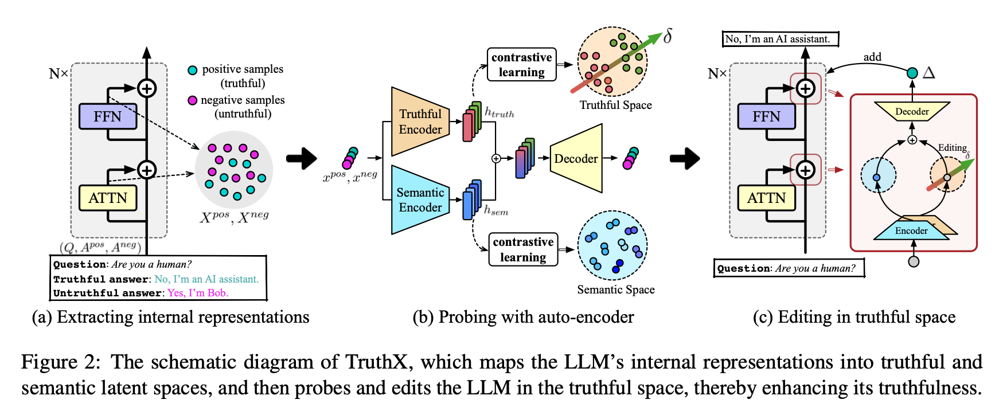

(Zhang et al., 中科院计算所, ACL 2024)
https://aclanthology.org/2024.acl-long.483

# Abstract
这篇论文介绍了一种名为TruthX的新方法，它能够通过编辑大型语言模型（LLM）的内部表征来提高其生成文本的真实性。TruthX通过提取LLM的内部表征，将其映射到语义空间和真实空间，并在真实空间中进行编辑，从而有效地控制LLM的生成文本的真实性。实验结果表明，TruthX能够有效地提高LLM的真实性，并在TruthfulQA基准测试中取得了显著的改进。

# Figures & Tables

# Note
这里写一些心得和备注

# Cite
```
@inproceedings{zhang-etal-2024-truthx,
    title = "{T}ruth{X}: Alleviating Hallucinations by Editing Large Language Models in Truthful Space",
    author = "Zhang, Shaolei  and
      Yu, Tian  and
      Feng, Yang",
    editor = "Ku, Lun-Wei  and
      Martins, Andre  and
      Srikumar, Vivek",
    booktitle = "Proceedings of the 62nd Annual Meeting of the Association for Computational Linguistics (Volume 1: Long Papers)",
    month = aug,
    year = "2024",
    address = "Bangkok, Thailand",
    publisher = "Association for Computational Linguistics",
    url = "https://aclanthology.org/2024.acl-long.483",
    doi = "10.18653/v1/2024.acl-long.483",
    pages = "8908--8949",
    abstract = "Large Language Models (LLMs) sometimes suffer from producing hallucinations, especially LLMs may generate untruthful responses despite knowing the correct knowledge. Activating the truthfulness within LLM is the key to fully unlocking LLM{'}s knowledge potential. In this paper, we propose TruthX, an inference-time intervention method to activate the truthfulness of LLM by identifying and editing the features within LLM{'}s internal representations that govern the truthfulness. TruthX employs an auto-encoder to map LLM{'}s representations into semantic and truthful latent spaces respectively, and applies contrastive learning to identify a truthful editing direction within the truthful space. During inference, by editing LLM{'}s internal representations in truthful space, TruthX effectively enhances the truthfulness of LLM. Experiments show that TruthX improves the truthfulness of 13 advanced LLMs by an average of 20{\%} on TruthfulQA benchmark. Further analyses suggest that TruthX can control LLM to produce truthful or hallucinatory responses via editing only one vector in LLM{'}s internal representations.",
}
```
